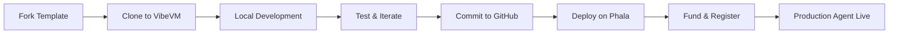

# ERC-8004 TEE Agent Template

Build trustless AI agents with [dstack](https://github.com/dstack-tee/dstack), ERC-8004 compliance, and seamless deployment on Phala Cloud.

## Features

- 🔐 **TEE-Derived Keys** - Intel TDX attestation via dstack CVM on Phala Cloud
- 🌐 **ERC-8004 Compliant** - Standard `/agent.json` endpoint
- 📜 **Real TEE Attestation** - Cryptographic proof of execution
- 🔗 **On-Chain Registry** - Decentralized agent discovery
- 🤖 **A2A Protocol** - Agent-to-Agent communication
- 🔧 **Config-Driven** - Easy customization via `agent_config.json`
- 🧪 **VibeVM Ready** - Local development environment

## Quick Start

### For Local Development (VibeVM)

1. **Fork or use this template**

   Click "Use this template" on GitHub or fork this repository

2. **Start VibeVM and clone**

   ```bash
   # Inside your VibeVM environment
   git clone https://github.com/YOUR_USERNAME/erc-8004-tee-agent.git
   cd erc-8004-tee-agent
   ```

3. **Configure environment**

   ```bash
   cp .env.local.example .env
   # Edit .env with your settings
   ```

4. **Install and run**

   ```bash
   pip3 install -e .
   python3 deployment/local_agent_server.py
   ```

5. **Test your agent**

   Open http://localhost:8000

### For Production Deployment (Phala CVM)

See [DEPLOYMENT.md](DEPLOYMENT.md) for complete deployment instructions.

```bash
# 1. Commit your production code
git commit -m "Production ready"
git push origin main

# 2. Note your commit hash
git rev-parse HEAD

# 3. Deploy on phala.com with docker-compose.yml
# 4. Set secrets: GITHUB_REPO, GIT_COMMIT_HASH, AGENT_SALT
# 5. Launch CVM and fund your agent
npx phala deploy -n erc-8004-tee-agent -c docker-compose.yml -e .env
```

## Developer Workflow



**Detailed steps:**

1. **Fork/Template** - Create your repository from this template
2. **VibeVM Development** - Clone into VibeVM for local testing
3. **Customize** - Edit `agent_config.json` and add your logic
4. **Test Locally** - Run agent in VibeVM, test registration flow
5. **Commit** - Push production-ready code to GitHub
6. **Deploy** - Use `docker-compose.yml` on Phala with your commit hash
7. **Launch** - Fund wallet, register on-chain, validate TEE

## Project Structure

```
erc-8004-tee-agent/
├── agent_config.json          # Agent metadata & capabilities
├── entrypoint.sh              # Build & deploy script (customize this!)
├── docker-compose.yml         # Production deployment config
├── .env.example               # Production environment template
├── .env.local.example         # Local development template
├── DEV_GUIDE.md              # Comprehensive developer guide
├── DEPLOYMENT.md             # Production deployment checklist
├── contracts/                 # Solidity contracts
├── src/agent/                 # Core agent logic
│   ├── tee_auth.py           # TEE key derivation & auth
│   ├── tee_verifier.py       # TEE attestation submission
│   ├── agent_card.py         # ERC-8004 card builders
│   ├── registry.py           # On-chain registry client
│   └── base.py               # Base agent functionality
├── deployment/
│   └── local_agent_server.py # FastAPI server
└── static/                    # Web UI assets
```

## Architecture

```
┌─────────────┐
│   Wallet    │ Fund with Base Sepolia ETH
└─────────────┘
       ↓
┌─────────────┐
│  Register   │ Identity Registry (on-chain)
└─────────────┘
       ↓
┌─────────────┐
│ TEE Verify  │ Attestation + Code Measurement
└─────────────┘
       ↓
┌─────────────┐
│    Ready    │ A2A endpoints active
└─────────────┘
```

## API Endpoints

- `GET /agent.json` - ERC-8004 registration-v1 format
- `GET /.well-known/agent-card.json` - A2A agent card
- `GET /api/status` - Agent status
- `POST /api/register` - Register on-chain
- `POST /api/tee/register` - Register TEE key
- `POST /api/metadata/update` - Update on-chain metadata
- `POST /tasks` - A2A task submission
- `GET /tasks/{id}` - Task status

## Deployed Contracts

**Base Sepolia:**
- IdentityRegistry: `0x8506e13d47faa2DC8c5a0dD49182e74A6131a0e3` (0.0001 ETH fee)
- TEERegistry: `0x03eCA4d903Adc96440328C2E3a18B71EB0AFa60D`
- Verifier: `0x481ce1a6EEC3016d1E61725B1527D73Df1c393a5`

## Configuration

**`.env`** - Runtime config:
```bash
AGENT_DOMAIN=your-domain.com
AGENT_SALT=unique-salt
IDENTITY_REGISTRY_ADDRESS=0x8506e13d47faa2DC8c5a0dD49182e74A6131a0e3
TEE_REGISTRY_ADDRESS=0x03eCA4d903Adc96440328C2E3a18B71EB0AFa60D
```

**`agent_config.json`** - Agent metadata:
```json
{
  "name": "Your Agent",
  "description": "Agent description",
  "endpoints": {
    "a2a": {"enabled": true},
    "mcp": {"enabled": false, "endpoint": ""},
    "ens": {"enabled": false, "endpoint": ""}
  },
  "evmChains": [
    {"name": "Base", "chainId": 8453}
  ],
  "supportedTrust": ["tee-attestation"]
}
```

## Customization

Edit `agent_config.json` to add endpoints:

**Add MCP:**
```json
"mcp": {
  "enabled": true,
  "endpoint": "https://mcp.agent.eth/",
  "version": "2025-06-18"
}
```

**Add chains:**
```json
{"name": "Polygon", "chainId": 137}
```

**Add trust models:**
```json
"supportedTrust": ["tee-attestation", "reputation"]
```

## Documentation

- **[DEV_GUIDE.md](DEV_GUIDE.md)** - Comprehensive developer guide covering:
  - Local development with VibeVM
  - Customizing your agent
  - Testing and debugging
  - Production deployment workflow

- **[DEPLOYMENT.md](DEPLOYMENT.md)** - Production deployment checklist:
  - Pre-deployment requirements
  - Phala CVM configuration
  - Post-deployment validation

- **[QUICKSTART.md](QUICKSTART.md)** - Get started in 3 minutes

## How It Works

1. **Key Derivation** - TEE derives wallet from `domain + salt`
2. **Local Development** - Test in VibeVM with simulated TEE
3. **Funding** - Add Base Sepolia ETH to derived wallet
4. **Registration** - Register agent on-chain (0.0001 ETH fee)
5. **TEE Attestation** - Submit cryptographic proof to verifier
6. **Production** - Deploy to Phala CVM with real TEE attestation
7. **Agent Live** - Accessible at `/agent.json` endpoint

## Tech Stack

- **TEE**: Intel TDX via Phala CVM/dstack
- **Blockchain**: Base Sepolia (testnet) / Base (mainnet)
- **Backend**: Python 3, FastAPI
- **Contracts**: Solidity ^0.8.20
- **Development**: VibeVM for local testing
- **Deployment**: Docker, Phala Cloud

## ERC-8004 Compliance

✅ Standard `/agent.json` endpoint (registration-v1)
✅ CAIP-10 wallet address format
✅ A2A protocol endpoints
✅ TEE attestation support
✅ On-chain registry integration
✅ Verifiable code measurement

## Customization

### Agent Metadata

Edit [agent_config.json](agent_config.json):

```json
{
  "name": "Your Agent Name",
  "description": "What your agent does",
  "endpoints": {
    "a2a": {"enabled": true},
    "mcp": {"enabled": false}
  }
}
```

### Agent Logic

Modify files in [src/agent/](src/agent/):

- Add custom endpoints in `deployment/local_agent_server.py`
- Implement custom logic in `src/agent/base.py`
- Configure blockchain interactions in `src/agent/registry.py`

### Build Process

Update [entrypoint.sh](entrypoint.sh) for custom setup:

```bash
# Add model downloads, DB initialization, etc.
echo "🤖 Downloading ML model..."
wget https://example.com/model.bin -O /app/model.bin
```

See [DEV_GUIDE.md](DEV_GUIDE.md) for detailed customization instructions.

## Deployment Checklist

Before deploying to production:

- [ ] Test thoroughly in VibeVM
- [ ] Update `agent_config.json` with production values
- [ ] Ensure `entrypoint.sh` has all required setup steps
- [ ] Commit production code to GitHub
- [ ] Note commit hash for deployment
- [ ] Set secrets on Phala: `GITHUB_REPO`, `GIT_COMMIT_HASH`, `AGENT_SALT`
- [ ] Configure CVM (2+ CPU, 4GB+ RAM, 10GB+ storage)
- [ ] Fund agent wallet with Base Sepolia ETH

See [DEPLOYMENT.md](DEPLOYMENT.md) for complete checklist.

## Getting Help

- **Issues**: [GitHub Issues](https://github.com/YOUR_USERNAME/erc-8004-tee-agent/issues)
- **Discussions**: [GitHub Discussions](https://github.com/YOUR_USERNAME/erc-8004-tee-agent/discussions)
- **Phala Discord**: [discord.gg/phala](https://discord.gg/phala)
- **VibeVM Docs**: [github.com/Phala-Network/VibeVM](https://github.com/Phala-Network/VibeVM)

## License

MIT

## Links

- **ERC-8004 Spec**: [eips.ethereum.org/EIPS/eip-8004](https://eips.ethereum.org/EIPS/eip-8004)
- **Phala Network**: [phala.network](https://phala.network)
- **VibeVM**: [github.com/Phala-Network/VibeVM](https://github.com/Phala-Network/VibeVM)
- **Base Sepolia**: [base.org](https://base.org)
- **Reference Implementation**: [dstack-erc8004-poc](https://github.com/h4x3rotab/dstack-erc8004-poc)

---

**Ready to build?** Start with [DEV_GUIDE.md](DEV_GUIDE.md) or jump into [QUICKSTART.md](QUICKSTART.md) 🚀
